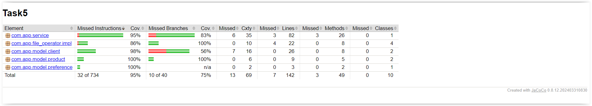

# Shopping program

This program is a tool enabling effective management of customer purchases, adapting them to individual preferences and financial possibilities, while offering extensive functions of purchasing data analysis.

## Technologies and libraries used

* Java
* Maven
* Lombok
* JUnit
* AssertJ

## Jacoco Coverage

## Required files

* Clients file with pattern:

  NAME;SURNAME;AGE;CASH;PREFERENCES

* Preferences with pattern:

  ID CATEGORY
* Products with pattern:
ID:NAME;QUANTITY;PRICE;CATEGORY

